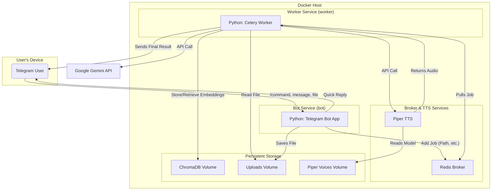

# Development Overview: Lumenote

This document provides a deep dive into the technical architecture, design decisions, and development workflow of the Lumenote project. It is intended for developers who will be working on or maintaining the codebase.

## Table of Contents

1.  [Core Philosophy & Vision](#1-core-philosophy--vision)
2.  [System Architecture](#2-system-architecture)
    -   [Diagram](#diagram)
    -   [Component Breakdown](#component-breakdown)
3.  [Technology Stack Rationale](#3-technology-stack-rationale)
4.  [Data Flow Deep Dive](#4-data-flow-deep-dive)
    -   [User Interaction (Q&A)](#user-interaction-qa)
    -   [Document Ingestion (Async Task)](#document-ingestion-async-task)
    -   [Podcast Generation (Async Task)](#podcast-generation-async-task)
5.  [Project Structure Explained](#5-project-structure-explained)
6.  [Key Configuration & Environment](#6-key-configuration--environment)
7.  [Development and Deployment Workflow](#7-development-and-deployment-workflow)
8.  [Troubleshooting and Debugging](#8-troubleshooting-and-debugging)

---

## 1. Core Philosophy & Vision

The primary goal of Lumenote is to provide a responsive, powerful, and personal AI assistant on Telegram. The key architectural driver is **asynchronous, non-blocking operation**. A user performing a simple, fast action (like asking a question) should **never** be blocked by another user performing a long, slow action (like generating a podcast).

This philosophy led to the decoupled, multi-component architecture centered around a job queue.

## 2. System Architecture

Lumenote is not a monolithic application. It is a distributed system orchestrated by Docker Compose, composed of four primary services and three persistent data volumes.

### Diagram

### Component Breakdown

-   **`bot` (The Receptionist)**:
    -   **Technology**: `python-telegram-bot` in `asyncio` mode.
    -   **Responsibility**: To be the fast, user-facing part of the system. It handles all incoming Telegram updates, validates user input, provides immediate acknowledgements ("On it!"), and its most important job is to **delegate** heavy work. It places a "job" (a Python function call with arguments) onto the Redis queue. It does **not** perform any LLM calls, file processing, or audio generation itself.

-   **`worker` (The Workhorse)**:
    -   **Technology**: `Celery` with a `Redis` backend.
    -   **Responsibility**: This is the engine of the application. It runs in the background, constantly watching the Redis queue for new jobs. When a job appears, it executes it. This includes:
        1.  Reading a document from the shared `uploads_volume`.
        2.  Chunking and embedding the document using LangChain and storing it in ChromaDB on the `chroma_data` volume.
        3.  Performing RAG lookups against ChromaDB.
        4.  Making expensive API calls to the Google Gemini LLM.
        5.  Making API calls to the Piper TTS service.
        6.  Using the `python-telegram-bot` library to send the final result (a file or image) back to the user who requested it.

-   **`redis` (The Job Board)**:
    -   **Technology**: Official Redis Docker image.
    -   **Responsibility**: Acts as the intermediary message broker. It decouples the `bot` from the `worker`. If the worker is busy or crashes, the jobs remain safely in the Redis queue until a worker is available to process them. This makes the system resilient.

-   **`piper` (The Voice)**:
    -   **Technology**: `lscr.io/linuxserver/piper` Docker image.
    -   **Responsibility**: A dedicated microservice for one task: converting text to speech. It exposes a simple HTTP endpoint that the `worker` can call. Keeping it as a separate service allows us to manage and update it independently.

## 3. Technology Stack Rationale

| Technology              | Reason for Choice                                                                                                                              |
| ----------------------- | ---------------------------------------------------------------------------------------------------------------------------------------------- |
| **Docker Compose**      | Essential for managing a multi-service application. It defines the entire stack, networking, and volumes in a single, reproducible file.         |
| **`python-telegram-bot`** | A mature, feature-rich library for Telegram bots with excellent `asyncio` support, which is critical for the non-blocking `bot` service.      |
| **Celery & Redis**      | The industry standard for background task processing in Python. It's robust, scalable, and perfectly suited for offloading long-running jobs.    |
| **LangChain**           | Provides high-level abstractions for building RAG (Retrieval-Augmented Generation) pipelines, handling document loading, chunking, and chaining. |
| **Google Gemini**       | The chosen Large Language Model for its powerful multi-modal and reasoning capabilities at a competitive cost.                                   |
| **ChromaDB**            | A simple, file-based vector database that is easy to set up for development and can be persisted with a simple Docker volume.                     |
| **Graphviz**            | A powerful and standard tool for programmatically generating graphs, which is perfect for creating mind maps from structured LLM output.        |
| **Pydantic-settings**   | Provides robust, type-safe loading of configuration from environment variables (`.env` file), preventing common configuration errors.         |

## 4. Data Flow Deep Dive

### User Interaction (Q&A)

1.  User sends a text message to the bot.
2.  The `bot` service receives the update via `python-telegram-bot`.
3.  The `handle_message` handler in `handlers.py` is triggered.
4.  It immediately sends a "typing" action to give user feedback.
5.  It calls `llm_service.get_rag_response()`.
6.  This service performs a **synchronous** RAG lookup in ChromaDB to find relevant context.
7.  The context and question are sent to the Gemini API.
8.  The `bot` service awaits the response from Gemini and sends the answer back to the user.
    *Note: This is the only "heavy" operation the main bot performs. It's kept here for low-latency Q&A, but could be offloaded to Celery if it proves to be too slow.*

### Document Ingestion (Async Task)

1.  User uploads a PDF file.
2.  The `bot` service's `handle_document` handler is triggered.
3.  It immediately replies to the user: "Got it! Processing your file..."
4.  It downloads the file and saves it to the shared `/app/uploads` volume.
5.  It calls `tasks.process_document_task.delay(...)`, adding a job to the Redis queue. The arguments include the `chat_id` and the path to the file on the shared volume.
6.  The `bot`'s work is done for now. It is free to handle other requests.
7.  The `worker` service picks up the job.
8.  It opens the file from the shared volume path.
9.  It uses `rag_service` to chunk the text, create embeddings (calling the Gemini embedding API), and store the vectors in ChromaDB.
10. Upon completion, the `worker` uses its own `Bot` instance to call `bot.send_message` and notify the user that processing is complete.

### Podcast Generation (Async Task)

1.  User sends `/podcast on the main topic`.
2.  The `bot` service's `generate_content_handler` is triggered.
3.  It replies immediately: "On it! Generating your podcast..."
4.  It adds the `tasks.generate_podcast_task.delay(...)` job to Redis.
5.  The `worker` picks up the job.
6.  It performs a RAG lookup in ChromaDB to get context for "the main topic".
7.  It prompts the Gemini LLM to write a podcast script based on the context.
8.  It takes the generated script and makes an HTTP POST request to the `piper` service's endpoint (`http://piper:5000/tts`).
9.  The `piper` service synthesizes the audio and returns the `.wav` file bytes.
10. The `worker` saves these bytes to a temporary file and then sends this audio file to the user via the Telegram API.

## 5. Project Structure Explained

-   **`bot/`**: Contains all code directly related to the Telegram bot interface. `main.py` starts the bot, and `handlers.py` defines what to do for each command.
-   **`core/`**: Holds core application setup code, like the `config.py` for loading environment variables.
-   **`services/`**: A crucial directory containing business logic decoupled from the bot interface. Each file is a client for an external service (`llm_service` for Gemini, `tts_service` for Piper) or a core part of our logic (`rag_service` for the vector database). This makes the code highly modular and testable.
-   **`tasks/`**: Defines the background jobs that will be run by Celery. `celery_app.py` is the configuration, and `tasks.py` contains the functions decorated with `@celery_app.task`.
-   **`utils/`**: A place for helper functions and constants that are used across the application, like the LLM `prompts.py`.

## 6. Key Configuration & Environment

-   **`.env`**: Stores all secrets. It is loaded by `pydantic-settings` in `core/config.py`. **Never commit this file.**
-   **`docker-compose.yml`**: The single source of truth for the entire application's infrastructure. It defines networking, service dependencies, and volume mounts.
    -   **DNS**: We explicitly set DNS to `8.8.8.8` to prevent resolution issues inside containers.
    -   **Volumes**: We use named volumes (`chroma_data`, `uploads_volume`, `piper_voices`) to persist data across container restarts.

## 7. Development and Deployment Workflow

1.  **Local Development**: `docker-compose up --build` is the primary command. It spins up the entire stack locally. Since the application code is mounted as a volume, changes to Python files are reflected instantly upon restarting the containers (`docker-compose restart bot worker`).
2.  **Deployment**: The project is designed to be deployed on any server with Docker and Docker Compose. The same `docker-compose up -d` command (with the `-d` for detached mode) would run the application in production.

## 8. Troubleshooting and Debugging

-   **View Logs**: The first step is always `docker-compose logs -f <service_name>`. For example, `docker-compose logs -f worker` will show you live logs from the Celery worker.
-   **"File Not Found"**: This almost always indicates a problem with shared volumes. Ensure the file is being saved by one container to a path that is mounted in the other container.
-   **`TimedOut` Errors**: This is a network latency issue. It was solved by increasing the `read_timeout` in the `python-telegram-bot` `ApplicationBuilder`.
-   **Library-Specific Bugs**: We encountered bugs with `chromadb` telemetry. The solution was to pin to a known-stable older version in `requirements.txt` and rebuild the image. This is a common strategy when dealing with fast-moving open-source libraries.